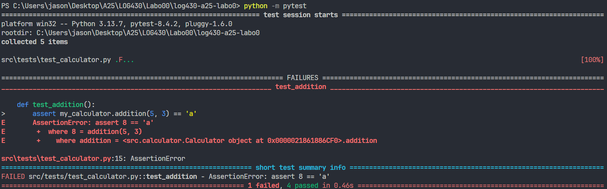
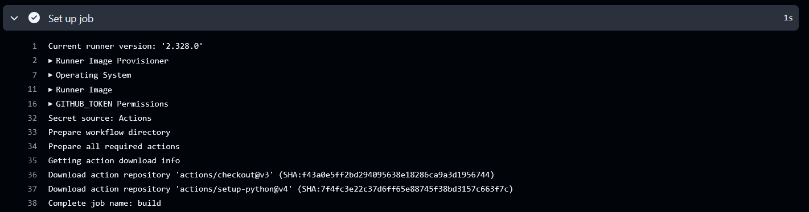
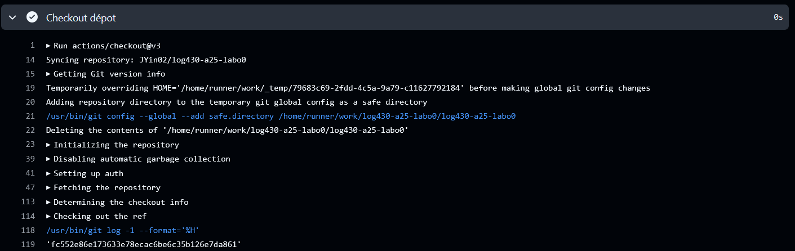

# Rapport du Labo 00 – Infrastructure (Git, Docker, CI/CD)

### Question 1 : Si l’un des tests échoue à cause d’un bug, comment pytest signale-t-il l’erreur et aide-t-il à la localiser ? Rédigez un test qui provoque volontairement une erreur, puis montrez la sortie du terminal obtenue?
Oui, elle signale l’erreur en précisant où la cause est dans le code du test et la raison de l’échec. 
>**Sorti du Terminal** 
---

### Question 2 : Que fait GitLab pendant les étapes de « setup » et « checkout » ? Veuillez inclure la sortie du terminal Gitlab CI dans votre réponse.
L’étape SetUp prépare ce qui est nécessaire pour lancer le programme comme installer Python et les autres modules comme pytest.	 L’étape Checkout prend le code que j’ai push le clone sur la VM de Github pour effectuer les prochaines étapes décrit dans le fichier de CI.

>**Setup Github CI** 

>**Checkout Github CI** 